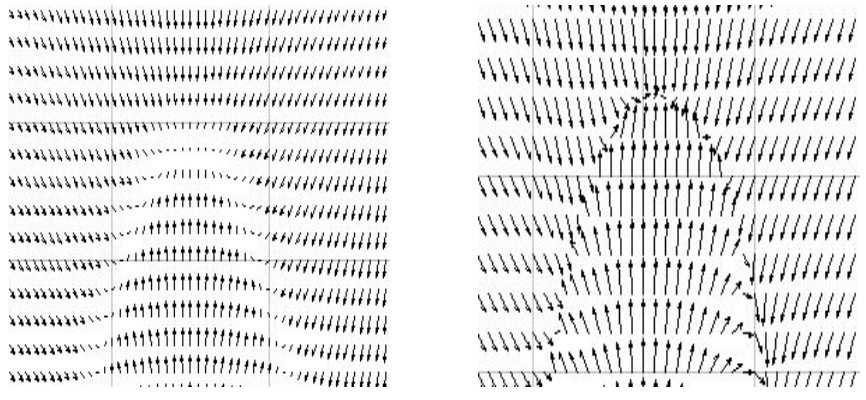
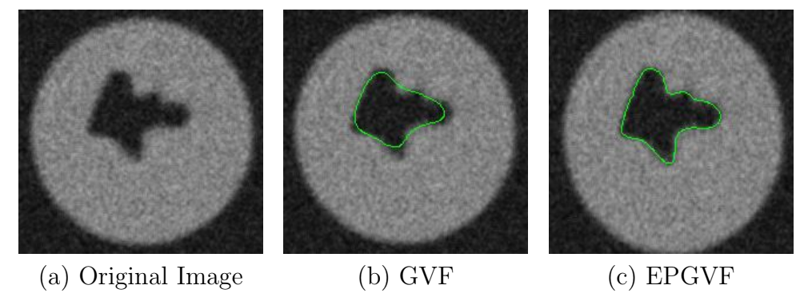
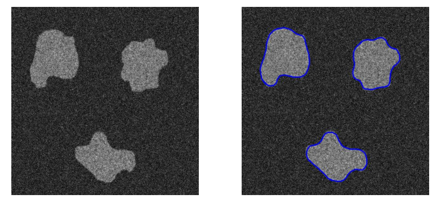

---

#### Computed Vector Fields

    
    

        <figcaption style="flex: 1; text-align: center; font-style: italic;">
            <strong>GVF (Gradient Vector Field)</strong>
        </figcaption>
        <figcaption style="flex: 1; text-align: center; font-style: italic;">
            <strong>EPGVF (Edge-Preserving GVF)</strong>
        </figcaption>
    

---

#### Algorithm Comparison

    
    <figcaption style="text-align: center; font-style: italic;">
        Fig. shows the difference between our algorithm working on two different vector fields 
        &mdash; <strong>GVF</strong> and <strong>EPGVF</strong>.
    </figcaption>

---

#### Multiple Regions of Interest

    
    <figcaption style="text-align: center; font-style: italic;">
        Our algorithm working on multiple regions of interest.
    </figcaption>

---

### Video

    <video controls style="width:100%;">
        <source src="/projects/affinesnakes/video.mp4" type="video/mp4">
    </video>
    <figcaption style="text-align: center; font-style: italic;">
        Here you see a real-time video of the Optimization and Curve evolution.
    </figcaption>

